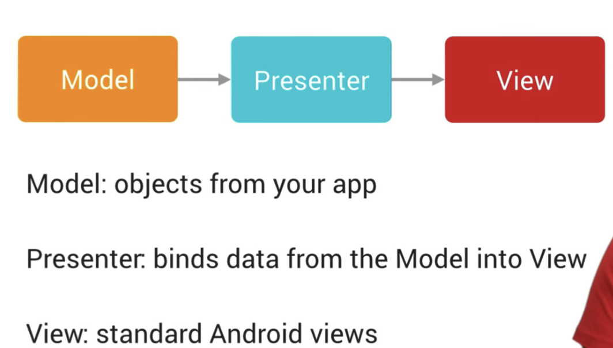

# Android TV瀑布流控件
**一种基于Android Leanback改造的Android TV瀑布流布局** 

示例效果如下：
<div align=center>
 
</div>  

### 解决的问题
瀑布流布局的运营按照栏目划分，每个栏目中的资源、海报宽高完全按运营需要自定义，
但Leanback不支持自定义栏目中的View的宽高、栏目中的View居中
### 特性  

- 以`行`做为瀑布流布局的运营单元，行的布局可以是`HorizontalGridView`或者`AbsoluteLayout`，也可以自定义`行`的布局
- 获得焦点的`View`自动居中显示
- 快速滑动时不会出现焦点移动不合理的情况
- 支持焦点自动换行，当焦点`View`在屏幕右边缘时按下右键，焦点会换行到下一行的第一个`View`，左边缘同理换行到上一行最后一个`View` 

### 使用
#### 1.设计理念
延用了Leanback中的`Model -> Presenter -> View`的理念：  
  
<div align=center>
 
</div>  

Presenters根据不同的数据创建不同的View，具体见[android/tv-samples](https://github.com/android/tv-samples)  

#### 2.使用方式
0. 根目录下`build.gradle`
```gradle
...
allprojects {
    repositories {
        ...
        //add jitpack.io repo
        maven { url 'https://jitpack.io' }
    }
}
...
```
module `build.gradle`
```gradle
implementation 'com.github.msisuzney:tv-waterfall-layout:1.0.0'
```
1. 继承`RowsFragment`
2. 添加`AbsoluteLayout`布局栏目，使用`AbsoluteLayoutCollection`定义栏目的宽高，再使用`AbsoluteLayoutItem`定义子`View`的位置、大小、bean类型与数据，
最后使用`setItems`方法将`AbsoluteLayoutItems`添加到`AbsoluteLayoutCollection`中
3. 添加水平滑动的`HorizontalGirdView`布局栏目，使用`HorizontalLayoutCollection`定义栏目的宽高，再使用`HorizontalLayoutItem`定义子`View`的大小、bean类型与数据，
最后使用`setItems`方法将`HorizontalLayoutItems`添加到`HorizontalLayoutCollection`
4. 使用`RowsFragment`#`add`方法将`AbsoluteLayoutCollection`/`HorizontalLayoutCollection`添加到布局中
5. 复写`RowsFragment`#`initBlockPresenterSelector`方法，返回的`PresenterSelector`用于根据bean类型为栏目创建不同的`View`

详细使用见demo module代码，简易代码如下：
```java
public class MyFragment extends RowsFragment {


    @Override
    protected PresenterSelector initBlockPresenterSelector() {
        //1.提供所有行中的运营位的Presenters，用于创建对应的View
        return new PresenterSelector() {
            @Override
            public Presenter getPresenter(Object item) {
                return new ImageViewPresenter(null);
            }
        };
    }

    @Override
    public void onViewCreated(View view, @Nullable Bundle savedInstanceState) {
        super.onViewCreated(view, savedInstanceState);
        //2. 构造水平滑动布局的Model
        HorizontalLayoutItem item = new HorizontalLayoutItem();
        item.setWidth(200);
        item.setHeight(200);
        List<HorizontalLayoutItem> items = new ArrayList<>();
        items.add(item);
        HorizontalLayoutCollection horizontalLayoutCollection =
                new HorizontalLayoutCollection(ViewGroup.LayoutParams.MATCH_PARENT, 200);
        horizontalLayoutCollection.setItems(items);

        //3. 构造绝对布局的Model
        AbsoluteLayoutItem item1 = new AbsoluteLayoutItem();
        item1.setHeight(200);
        item1.setWidth(200);
        item1.setX(200);
        item1.setY(10);
        List<AbsoluteLayoutItem> items1 = new ArrayList<>();
        items1.add(item1);
        AbsoluteLayoutCollection absoluteLayoutCollection =
                new AbsoluteLayoutCollection(ViewGroup.LayoutParams.MATCH_PARENT, 400);
        absoluteLayoutCollection.setItems(items1);
        
        //4. 添加到布局中
        add(horizontalLayoutCollection);
        add(absoluteLayoutCollection);
    }
}


```
#### 3.其他功能
1. 实现焦点换行，需要栏目中的View使用`FocusLineFeedFrameLayout`作为根布局
2. 状态监听，栏目中的`View`实现`StateChangedObserver`接口,并将自己注册给`StateChangeObservable`
也可以复写`RowsFragment`#`initStateChangeObservable`方法返回自定义的`StateChangeObservable`